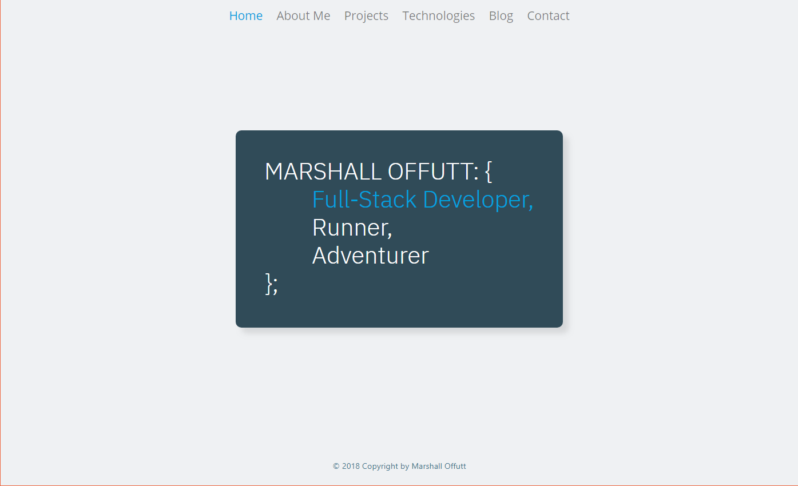
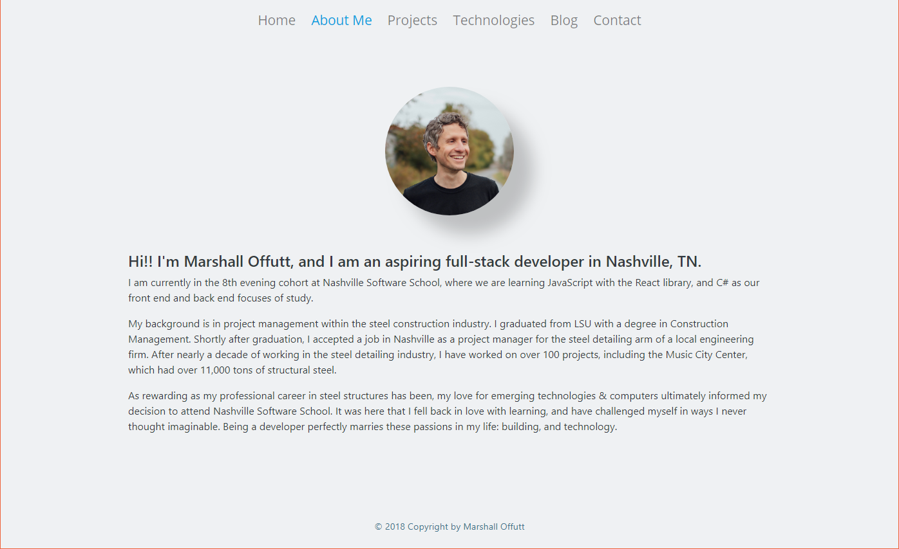
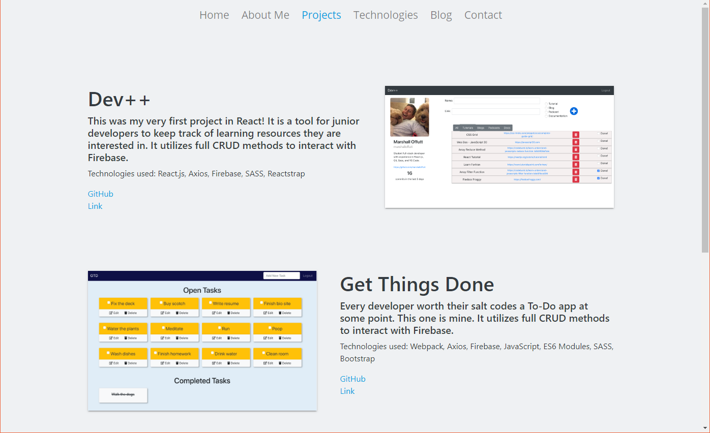
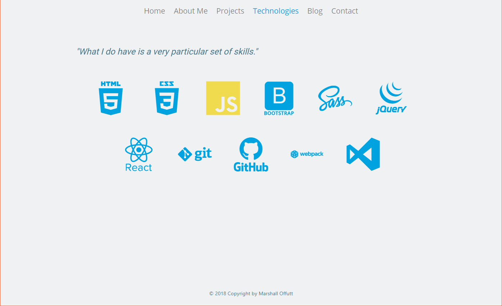
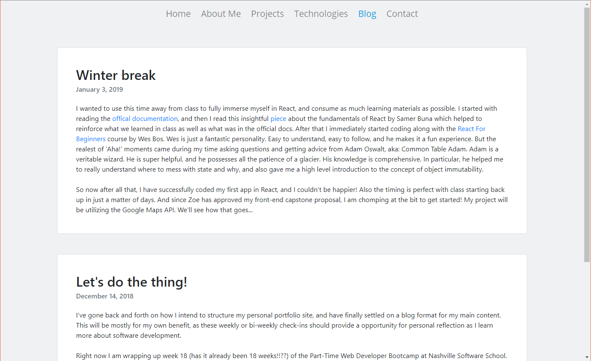
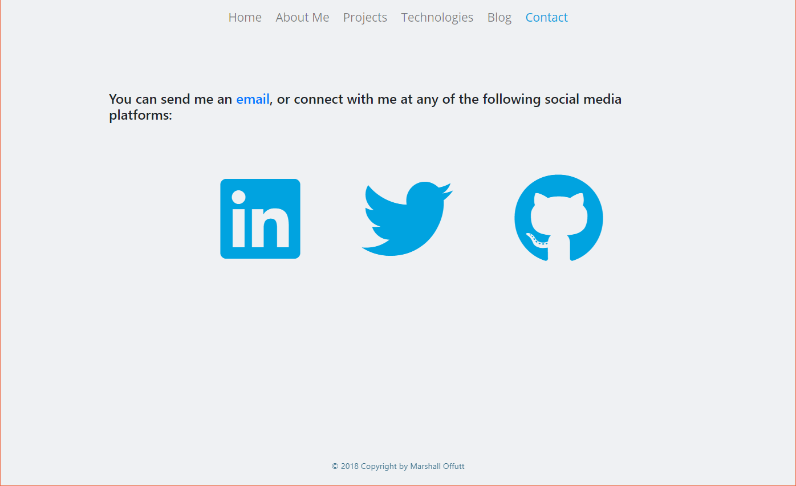

# My Personal Bio Site

## Description
This is a personal bio portfolio site dedicated to me. I will be updating this repo periodically.

## Screenshots

## Technologies Used
* Bootstrap
* Webpack
* Axios
* Firebase
* JavaScript ES6 Modules
* Font Awesome
* Devicon

## How to run this app
Note: To run this app you will need a firebase account and a new project.

### 1. Configure Firebase
1. Clone the repository to your local machine.
2. Run the following command in terminal to download the web dependencies: `npm install`
3. In the db folder, rename apiKeys.json.example to apiKeys.json.
4. In Firebase, create a new project.
5. Navigate to your config object, and copy the keys from Firebase into the apiKeys.json file.
6. Create a realtime databse in Firebase, and start in test mode.
7. Import the `./db/blogs.json` and `./db/projects.json` files into the database to seed data.

### 2. Serve up the app
* Run `npm start` in your terminal to initiate the app.
